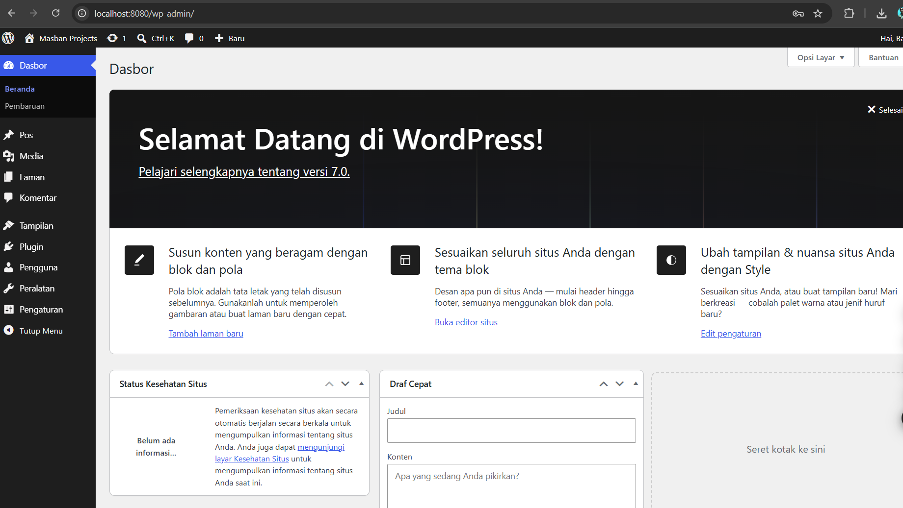

PROYEK WORDPRESS DENGAN DOCKER
Proyek ini mengimplementasikan WordPress menggunakan Docker Compose dengan:
- Container MariaDB untuk database
- Container WordPress untuk aplikasi
- Volume untuk persistensi data
- Network isolation (frontend-net & backend-net)

## Hasil Instalasi

## Kontribusi
Lihat [CONTRIBUTIONS.md](CONTRIBUTIONS.md) untuk detail kontribusi tim.
